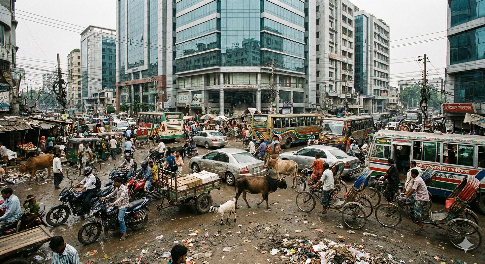
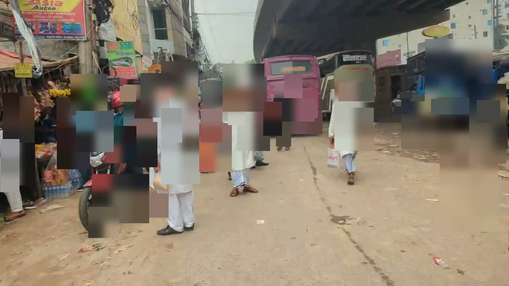
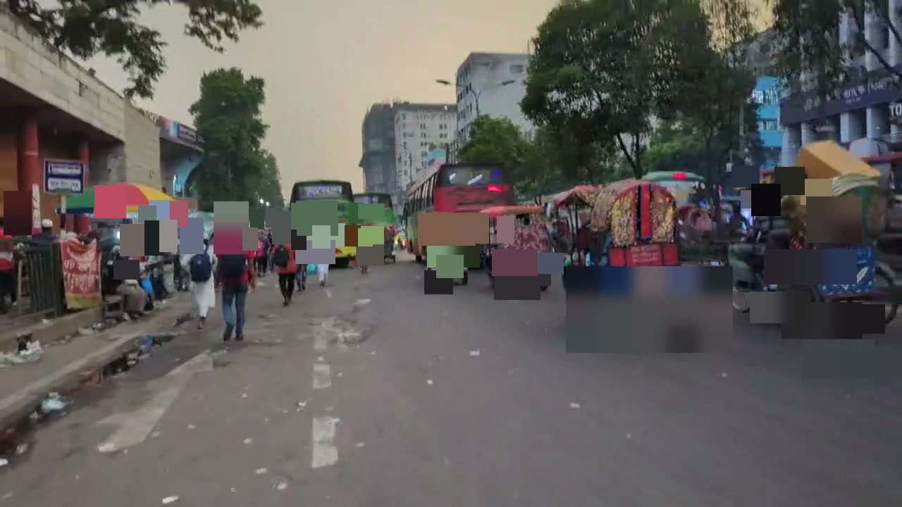
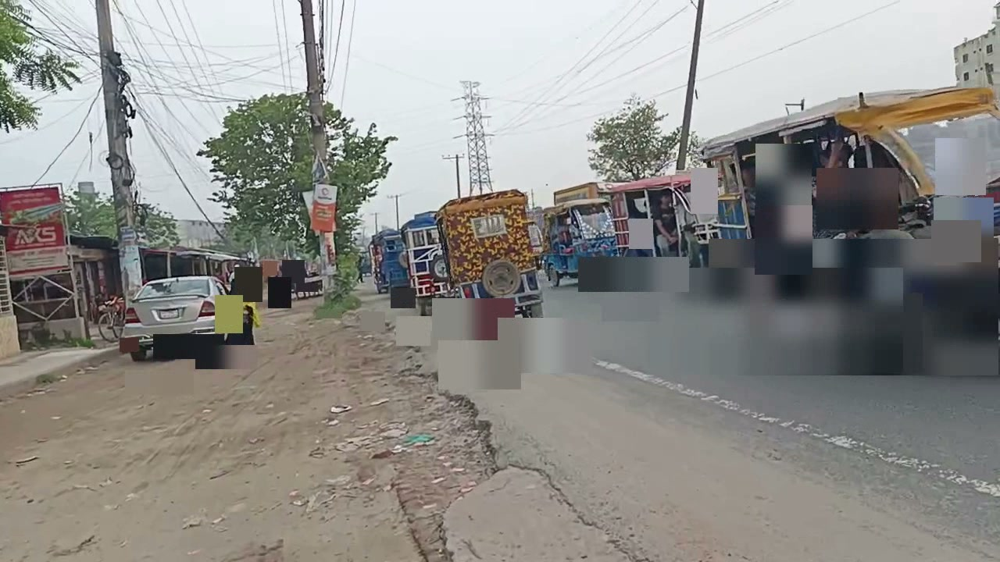
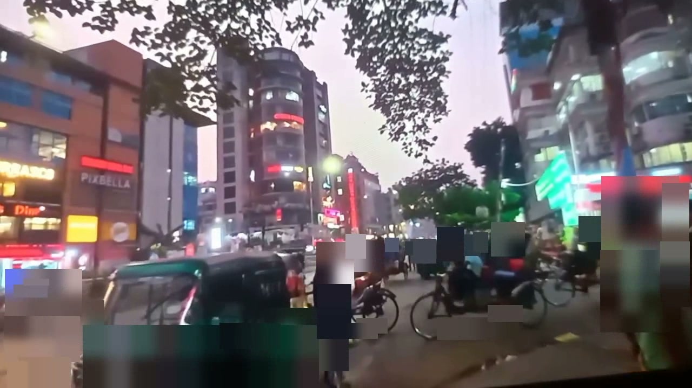
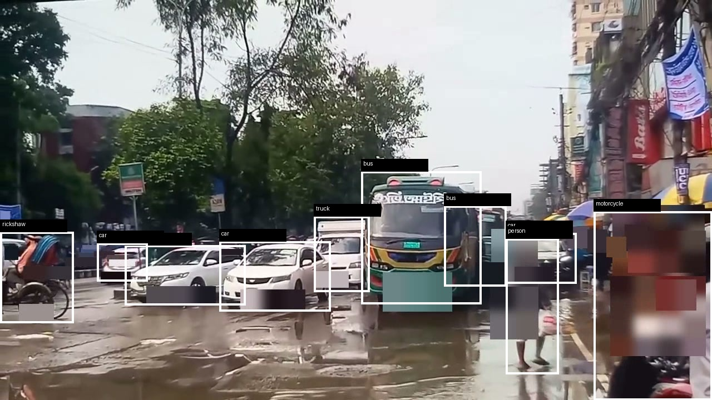
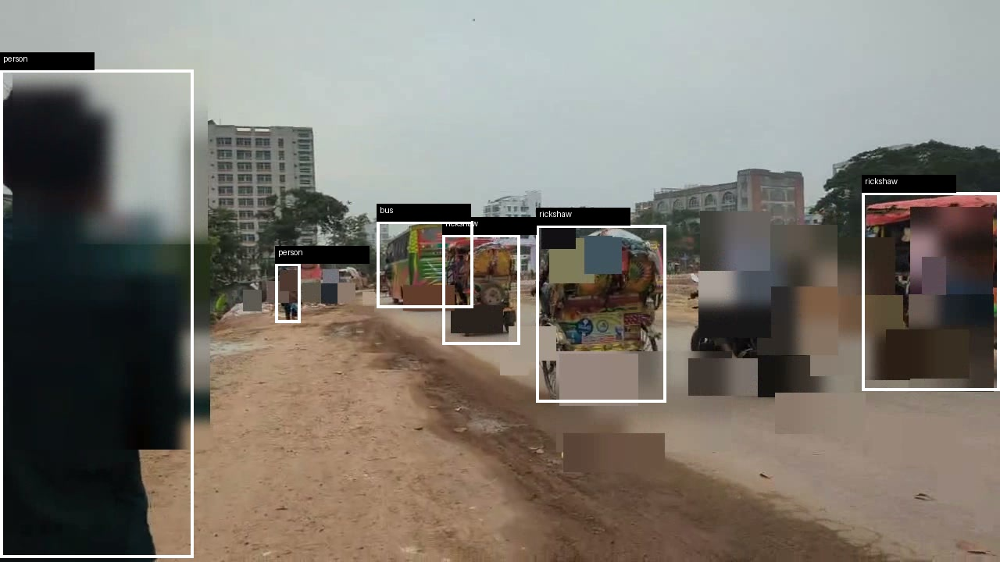
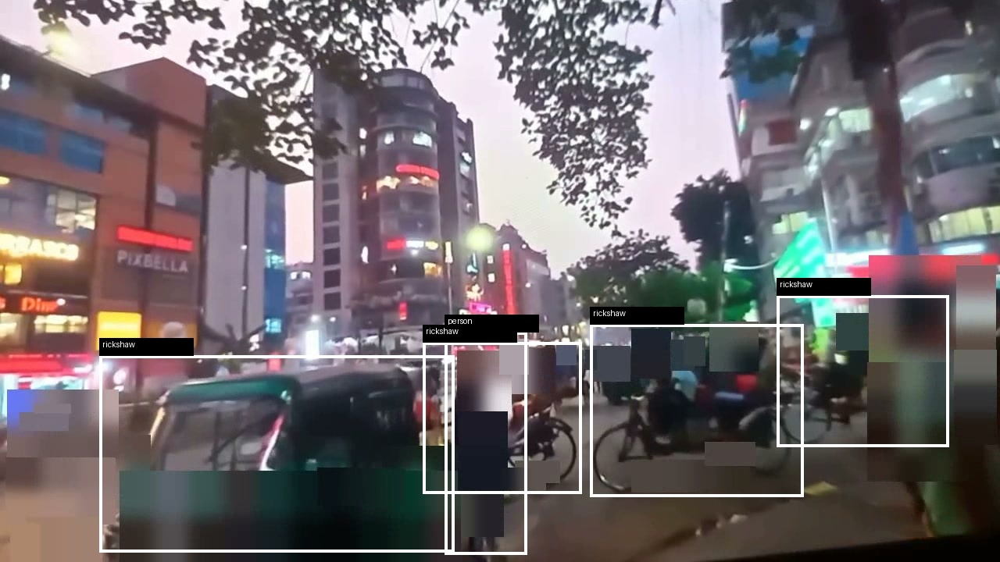

# Bangladesh Urban Traffic Dataset (Dhaka Mixed Traffic Dataset) — Free Sample

> **Commercial licensing available**
>
> Origin Data Lab provides real-world urban traffic datasets for autonomous driving, robotics, physical AI, computer vision, and perception system development.
>
> **Free Sample Dataset:** This repository  
> **Discovery Pack:** $500 USD  
> **Commercial Licensing:** Custom pricing depending on project scope and usage  
>
> **Contact:** contact@origindatalab.io  
> **Website:** https://origindatalab.io  
> **Hugging Face Sample:** https://huggingface.co/datasets/origindatalab/bangladesh-urban-traffic-free-sample-v2

This Bangladesh Traffic Dataset contains real-world mixed traffic scenes including rickshaws, motorcycles, buses, cars, pedestrians, market congestion, intersections, and complex urban mobility patterns.

The dataset is designed for computer vision, object detection, autonomous driving, ADAS, robotics, perception systems, physical AI, traffic analytics, and emerging-market mobility research.

This repository serves as a free sample of a larger Dhaka Traffic Dataset and Mixed Traffic Dataset developed by Origin Data Lab.

---

## Commercial Access Available

Need a larger mixed-traffic dataset for model evaluation or internal PoC?

- Discovery Pack: $500 — 120 curated 15-second clips
- Evaluation Pack: $2,000 — broader enterprise evaluation dataset
- Use cases: Autonomous Driving, Robotics, ADAS, Physical AI, Object Detection
- Delivery: secure commercial download after checkout

👉 Buy Discovery Pack:
https://origindatalab.lemonsqueezy.com/checkout/buy/46ece78e-7e3e-4c5f-87ca-95f582934d0a

Website: https://origindatalab.io  
Email: contact@origindatalab.io

---

## Gallery

Representative scenes from Dhaka, Bangladesh, including flooded roads, market zones, rickshaw-dense environments, pedestrian-heavy interactions, mixed traffic corridors, and low-light urban mobility scenarios.

These environments represent real-world edge cases that are rarely covered by conventional Western driving datasets.

<table>
<tr>
<td align="center">
 
<b>Flooded Mixed Traffic</b> 
Waterlogged road with buses, rickshaws, and pedestrians.
</td>

<td align="center">
 
<b>Rickshaw-Dense Corridor</b> 
High-density informal urban mobility environment.
</td>

<td align="center">
 
<b>Low-Light Urban Mobility</b> 
Dusk conditions with mixed traffic and reduced visibility.
</td>
</tr>

<tr>
<td align="center">
 
<b>Flooded Traffic Interaction</b> 
Multi-class traffic operating under flood conditions.
</td>

<td align="center">
 
<b>Market Zone Pedestrian Density</b> 
Dense pedestrian activity near informal roadside markets.
</td>
</tr>
</table>

### Preview Privacy Notice

Preview images shown in this repository use aggressive masking to accelerate public sharing and privacy protection.

Commercial delivery packages include production-grade privacy processing workflows designed to preserve scene structure, object geometry, and computer vision usability while protecting personal identity information.

---

## Preview Video

This short preview demonstrates real-world mixed traffic conditions collected in Dhaka, Bangladesh, including:

* Rickshaws
* Motorcycles
* Buses
* Pedestrians
* Market-zone congestion
* Dense urban interactions

---

### Watch the Video

▶ **Watch the Bangladesh Urban Traffic Preview Video**

[Bangladesh Urban Traffic Preview Video](./Bangladesh_Urban_Traffic_Discovery_Pack_v1_Preview_WEB.mp4)

If the embedded player is supported by your browser, the video can be viewed directly from this repository.

---

## Annotation Preview

<table>
<tr>
<td></td>
<td></td>
<td></td>
</tr>
</table>

Representative annotation previews generated from the Origin Data Lab labeling pipeline.

Note: Preview images are privacy-reduced examples. Commercial deliveries include additional review assets and metadata under applicable licensing terms.

Classes currently demonstrated:

- person
- car
- bus
- truck
- motorcycle
- bicycle
- rickshaw

---

# Commercial Access

This repository is a free technical preview intended for buyer evaluation and technical review.

Full commercial delivery is available separately.

Discovery Pack purchases can be completed instantly through secure checkout.

---

## Discovery Pack — $500

Designed for initial evaluation and proof-of-concept projects.

👉 [Buy Discovery Pack ($500)](https://origindatalab.lemonsqueezy.com/checkout/buy/46ece78e-7e3e-4c5f-87ca-95f582934d0a)

Instant commercial access after checkout.

Includes:

* 120 curated traffic clips
* Mixed traffic scenarios
* Market-zone traffic
* Intersection traffic
* Dense pedestrian interactions
* Metadata package
* Commercial evaluation license

---

## Evaluation Pack — $2,000

Designed for enterprise evaluation, internal model testing, and broader mixed-traffic robustness review before a larger commercial engagement.

Includes:

* Extended evaluation dataset
* Broader scene coverage than the Discovery Pack
* Additional metadata coverage
* Enterprise PoC support
* Buyer consultation support

---

### Contact

Website: https://origindatalab.io

Email: [contact@origindatalab.io](mailto:contact@origindatalab.io)

---

## Search Keywords

This dataset may also be relevant for users searching for:

* Bangladesh Traffic Dataset
* Dhaka Traffic Dataset
* Urban Traffic Dataset
* Mixed Traffic Dataset
* Rickshaw Dataset
* Road Scene Dataset
* Autonomous Driving Dataset
* ADAS Dataset
* Computer Vision Dataset
* Physical AI Dataset
* Robotics Dataset
* Traffic Video Dataset

---

# Why This Dataset Matters

Most autonomous driving datasets focus on structured road environments.

Dhaka traffic presents a fundamentally different challenge:

- Rickshaws
- CNG auto-rickshaws
- Informal lane behavior
- Dense pedestrian interactions
- Market congestion
- Occlusions
- Unstructured vehicle movement
- Mixed mobility environments

These characteristics create valuable edge cases for:

- Autonomous driving
- ADAS
- Object detection
- Multi-object tracking
- Robotics
- Physical AI
- Domain adaptation
- Annotation planning
- Emerging-market mobility research

---

# What Is Included In This Repository

This public repository contains:

- Preview video
- buyer_sample_index.csv
- dataset_manifest.json
- Hero image
- Gallery images
- Annotation preview
- Dataset card

This repository is intended for technical review and dataset evaluation.

The complete commercial dataset is delivered separately.

---

# Dataset Statistics & Technical Overview

This commercial dataset is derived from a larger Bangladesh urban mobility inventory built for robotics, perception, autonomous driving, ADAS, and Physical AI evaluation.

## Inventory Scale

* 39,041 analyzed traffic segments
* 5,921 unique source videos
* 39,041 buyer-value scored segments
* 12,148 GPS-enriched segments
* 12,710 segments with object-count metadata
* 11,922 estimated car instances across object-count-ready segments
* Privacy-reduced preview assets available

The Discovery Pack is a curated commercial subset selected from this larger analyzed inventory.

## Representative Scene Distribution

| Scene Type | Segment Count |
|---|---:|
| Intersection Traffic | 10,182 |
| Night / Low-Light Mobility | 5,635 |
| Market Areas | 2,754 |
| Mixed Traffic Roads | 2,189 |
| Vehicle-Rich Corridors | 1,381 |
| Tracking / Occlusion Scenarios | 1,110 |
| Straight Urban Roads | 448 |
| Pedestrian-Dense Areas | 214 |

## Buyer-Facing Quality Distribution

| Quality Tier | Segment Count |
|---|---:|
| Strong Commercial Candidates | 10,330 |
| Usable Commercial Candidates | 11,792 |
| Commercially Usable Total | 22,122 |

## Sensor Metadata Distribution

| Metadata Tier | Segment Count |
|---|---:|
| Prime Sensor Metadata | 8,086 |
| Standard Sensor Metadata | 20,425 |
| GPS-Enriched Segments | 12,148 |
| Object-Count Metadata Available | 12,710 |

## Representative Object Categories

Object categories represented throughout the collection include:

* Rickshaw
* CNG Auto-Rickshaw
* Motorcycle
* Pedestrian
* Car
* Bus
* Truck
* Bicycle

## Metadata Signals

Commercial packages may include:

* GPS metadata
* IMU metadata
* Motion-related metadata
* Scene classification tags
* Traffic density indicators
* Object-count metadata
* Privacy QA metadata
* Buyer-facing evaluation indexes

---

# Preview Summary

- Country: Bangladesh
- City: Dhaka
- Scenario Type: Urban Mixed Traffic
- Data Type: Video Preview + Metadata Sample
- Commercial Pack Available: Yes
- Discovery Pack Size: 120 Curated Clips
- Delivery Format: Individual 15-second clips
- Commercial Delivery: Secure download link after purchase or direct buyer handoff

Additional commercial metadata includes:

- GPS metadata
- IMU metadata
- Scene labels
- Object counts
- Privacy QA reports
- Buyer-facing indexes

---

# Metadata Overview

Commercial packages include metadata designed for dataset filtering and technical review.

Examples include:

- Object composition metadata
- GPS motion metadata
- IMU motion metadata
- Lighting metadata
- Traffic density metadata
- Tracking difficulty metadata
- Annotation readiness metadata
- Privacy QA metadata
- Buyer-use-case tags

The files in this repository provide a sample of the metadata structure.

---

# Transparency Notice

Origin Data Lab follows a transparency-first policy.

Unless explicitly marked as human-verified:

- Object labels may be machine-generated weak labels.
- Tracking metrics may be estimated.
- Environmental metadata may contain automated enrichments.
- GPS and IMU signals should be independently reviewed for safety-critical applications.

Recommended uses:

- Dataset discovery
- Buyer evaluation
- Annotation planning
- Internal PoC testing
- Domain adaptation review

Not recommended without additional validation:

- Safety certification
- Benchmark ground-truth evaluation
- Calibration-grade sensor analysis

---

# Privacy Status

Commercial delivery packs are prepared with privacy-reduction workflows.

Where required:

- Face blur applied
- License plate blur applied

Privacy documentation and QA reports are included in commercial packages.

---

# Custom Annotation Service

Available on request:

- Human annotation
- Bounding box refinement
- Rickshaw-specific labeling
- Custom class definitions
- Customer-specific annotation formats

Contact:

contact@origindatalab.io

---

# Origin Data Lab

Origin Data Lab builds real-world traffic datasets for:

- AI
- Robotics
- ADAS
- Autonomous Driving
- Physical AI

Website:

https://origindatalab.io

Email:

contact@origindatalab.io
